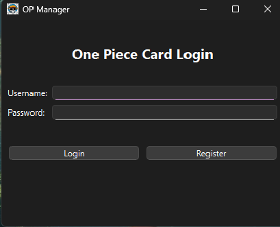
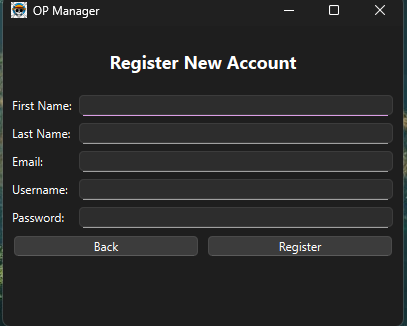
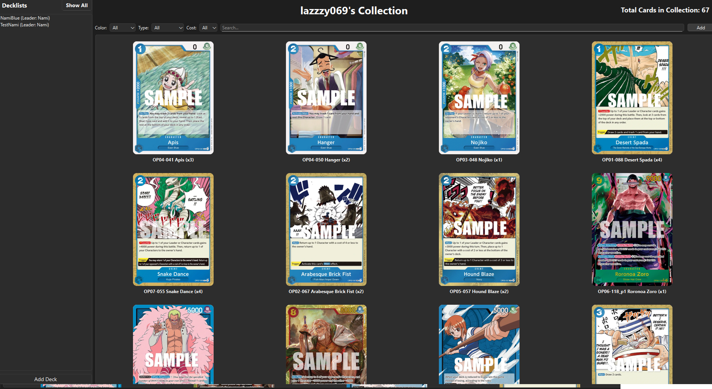

# One Piece TCG Collection Manager

A desktop application for managing your **One Piece Trading Card Game** collection.  
Track all your cards, build decklists, and keep your collection organized.

## 📸 Screenshots

### Login

### Register

### Main Collection View

*(Add more screenshots for Deck List Window and Card View if available)*

## ✨ Features
- **Collection Tracking** – Easily add and organize all your One Piece TCG cards.
- **Deck Builder** – Create and manage multiple deck lists.
- **Search & Filter** – Quickly find cards by name, type, cost, or color.
- **User Accounts** – Register and log in to keep collections private.
- **Clean UI** – Dark mode design for comfortable use.
